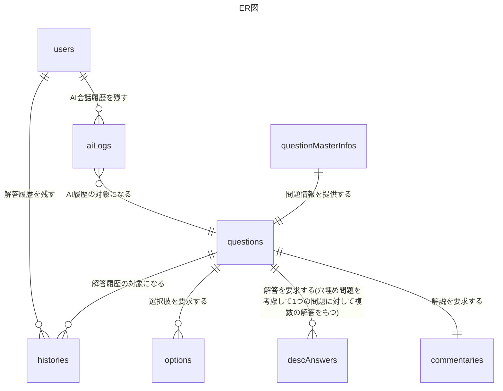

# データベーススペシャリスト過去問問答 要件定義書

| 項目 | 内容 |
| --- | --- |
| バージョン | 0.1  |
| 最終更新日 | 2026-05-26 |
| ステータス | 完了 |

---

## 1. プロジェクト概要

### 1.1 背景

IPAが運営するデータベーススペシャリスト試験（以下、DBスペシャリスト試験）の対策において過去問演習は重要であり、過去問学習ができるサイトとして「データベーススペシャリスト過去問道場」がある。
しかし、過去問道場ではAIを使った伴走型の学習はサポートされておらず、過去問×AIのサービスが存在しないため本プロジェクトに着手する。

### 1.2 目的（Why）

本プロジェクトは、2027年2月に実施予定のDBスペシャリスト試験対策のためのものである。データベーススペシャリスト過去問道場では対応できない課題をAIによって解決することを目的とする。

| 観点 | 過去問道場 | 過去問問答 |
| --- | --- | --- |
| 間違えた理由の深堀り | 解説を見せるだけ | AIと対話しながら深める |
| 記述問題の対策 | なし | AIによる自動採点 |
| 類似問題の対策 | なし（過去問の中からのみ出題） | AIが類似問題を作成(v2で対応予定) |

### 1.3 目標（SMART）

| # | 目標 | 指標（KPI） | 期限 |
| --- | --- | --- | --- |
| G-1 | AI振り返り機能リリース | ユーザーが着手した問題に関する会話をAIと最低1往復できること。 | 2026-07-31 |
| G-2 | 使用感満足度 | G-1機能に関して、可用性・レスポンス時間などの総合的な観点から、過去問道場よりも過去問問答を使用したいとユーザーが思えること（1ユーザーの所感）。 | 2026-08-31 |
| G-3 | 記述対策機能リリース | DBスペシャリスト試験の記述形式の過去問演習ができること。その問題に対する会話をAIと最低1往復以上できること。 | 2026-10-01 |
| G-4 | 過去問演習量 | G-1からG-3の実装と並行して過去問の演習を最低5年分、解説確認まで完了していること。(春季/秋季両方) | 2027-02-01 |

### 1.4 スコープ

**やること（In Scope）**
- 過去問構造化（データ準備）
- 過去問演習機能
- AI振り返り機能
- 記述問題対策機能
- UT
- E2Eテスト
- 過去問演習

**やらないこと（Out of Scope）**
- 苦手分析機能
- スマートフォン対応（レスポンシブ対応）
- 会員登録・ログイン機能
- デプロイ
- 結合テスト
- 類似問題出題機能（v2へ）

### 1.5 前提・制約

**前提**

- 使用端末：PCのみ
- 利用環境：ローカル
- ユーザー：開発者本人（1人）
- 非商用：商用利用しない（理由：個人開発のため）

**制約**

- 開発リソース：1人
- 使用技術：Python + React + AnthropicAPI
- データの使用：出典を明記する（例：出典：平成31年度 春期 データベーススペシャリスト試験 午前Ⅱ 問1）

---

## 2. ユーザー・利用シーン

### 2.1 ペルソナ

| ID | ペルソナ名 | 属性 | 利用シーン | 抱える課題 |
| --- | --- | --- | --- | --- |
| P-1 | 森田悠斗 | 実務経験2年のバックエンドエンジニア | データベーススペシャリスト試験過去問演習を平日21時～22時の間に行う | 下記に箇条書きで記載 |

1. AIを使用して過去問についての質問をする際、毎回試験問題の説明をするのに苦労している
2. 記述問題の採点が難しい
3. 過去問の問題量に限界があり理解が深まらない(v2で対応予定)

### 2.2 主要ユースケース

- UC-1(G-1)：ユーザーが年度や時間(午前or午後など)・問題数をWeb画面で指定。対象の問題が出題される。
- UC-2(G-3)：記述問題のユーザーの解答に対して、AIが採点し、解答結果及び解説が出力される。（「ペルソナ抱える課題」の2に対応）
- UC-3(G-1)：ユーザーが解答結果及び解説について、AIにチャットで質問する。（「ペルソナ抱える課題」の1に対応）
- UC-4(G-4)：ユーザーが間違えた問題やユーザーが深堀したい問題について、AIに類似問題の出題を依頼し、類似問題が出題される（「ペルソナ抱える課題」の3に対応）/ 出題後はUC-2,3に合流する(v2で対応予定)

---

## 3. 機能一覧

> 機能を網羅的に列挙する。優先度は MoSCoW（Must / Should / Could / Won't）。

| ID | カテゴリ | 機能名 | 概要 | 優先度 |
| --- | --- | --- | --- | --- |
| F-001 | データ準備 | 過去問構造化機能 | IPAが提供する過去問PDFを活用できるデータに変換する | Must |
| F-002 | データ準備 | 過去問解答用意機能（選択式問題） | IPAが提供する過去問解答PDFを利用し、解答をDBに保存する | Must |
| F-003 | データ準備 | 過去問解答用意機能（記述式問題） | IPAが提供する過去問解答PDFを利用し、解答例を生成する | Must |
| F-004 | データ準備 | 過去問解説用意機能 | 過去問の解説をAIが生成する | Must |
| F-005 | 出題 | 過去問出題機能 | ユーザーが指定した試験回の問題を出力する | Must |
| F-006 | 結果 | サマリ機能 | ユーザーの解答結果をまとめる | Must |
| F-007 | 採点 | 採点機能（選択式問題） | ユーザーの解答に対して保存済みの解答と照合して採点する | Must |
| F-008 | 採点 | 採点機能（記述式問題） | ユーザーの解答に対してAIが正誤判定をし、採点する | Must |
| F-009 | データ準備 | 類似問題作成機能 | 過去問それぞれに対して問題の類似問題を作成する（解答例/解説も作成する） | Won't(v2) |
| F-010 | 出題 | 類似問題出題機能 | ユーザーの依頼を受けて類似問題の出題をする | Won't(v2) |
| F-011 | 採点 | 類似問題採点機能 | 類似問題の採点をする | Won't(v2) |
| F-012 | AI対話 | AIチャット機能 | 問題、解答、解説テキスト、AIが作成した解答例、チャット内容を使用しAIがユーザーの質問に回答する | Must |

---

## 4. 機能要件（詳細）

### F-001 過去問構造化機能

- 概要：IPAが提供するデータベーススペシャリスト過去問のPDFファイルを読み込み、機能F-005から参照可能な構造としてDB等に保存する。
- 入力：PDFファイル（問題冊子：午前Ⅰ、午前Ⅱ、午後Ⅰ、午後Ⅱ）。
- 振る舞い：開発者がローカルに配置した問題文のPDFから問題文と図表を抽出し、問題文をDBに保存、及び図表を画像ファイルに変換して保存するバッチ。

  1. 開発者がコマンドでバッチを実行する。
  2. 問題文を抽出する。問題文と画像挿入位置をDBに保存し図は画像データファイルとして保存する。
  3. 既に登録済みや問題数が合わないなどの異常があった場合はエラーログを出力し、実行を停止する。

- 出力・成功条件：DB。PDFの読み込みが成功し、PDFと同じ問題文になっていること。図表の抽出・保存が成功していること。
- エラー・例外：PDFの読み込み失敗。フォーマット異常、文字化け、重複、抽出漏れなど。例外時は処理全体を停止する。
- 関連画面・画面遷移：バッチ処理のため、該当なし。

### F-002 過去問解答用意機能（選択式問題【午前Ⅰ・午前Ⅱ】）

- 概要：IPAが提供するデータベーススペシャリスト過去問の解答PDFを読み込み、F-007で使用できるデータとして、各選択肢（Option）の正解フラグをDBに保存する。（選択式）
- 入力：PDFファイル（解答）
- 振る舞い：問題番号と正解の選択肢のセットをPDFから読み込み、該当する選択肢（Option）の正解フラグをDBに保存する。

  1. 開発者がコマンドでバッチを実行する。
  2. 問題番号・正解の選択肢を抽出し、該当する選択肢（Option）の正解フラグをDBに保存する。
  3. 重複での登録や一部登録失敗した場合はエラーログを出力し、実行を停止する。

- 出力・成功条件：DB。全ての問題について、正解の選択肢の正解フラグがDBに保存されていること。
- エラー・例外：PDF読み込み失敗、DB保存失敗など。例外時は処理全体を停止する。
- 関連画面・画面遷移：バッチ処理のため対象外。

### F-003 過去問解答用意機能（記述式問題【午後Ⅰ・午後Ⅱ】）

- 概要：IPAが提供するデータベーススペシャリスト過去問の解答PDFを読み込み、F-008で使用する際に参照するmdファイルとして保存する。（図表をそのまま使用できるため、DBではなくmdファイルとしてストレージに保存する）
- 入力：PDFファイル（解答）
- 振る舞い： 解答例を読み込み、採点時に読み込みやすいmd形式に変換して保存する。

  1. 開発者がコマンドでバッチを実行する。
  2. 解答を読み込み、md形式に変換する。
  3. 重複での登録や一部登録失敗した場合はエラーログを出力し、実行を停止する。

- 出力・成功条件：mdファイル。全ての解答がファイルに保存されていること。
- エラー・例外：PDF読み込み失敗、保存失敗など。例外時は処理全体を停止する。
- 関連画面・画面遷移：バッチ処理のため対象外。
- 注意点：穴埋め問題の解答用意もこの機能に含む。（ただし自由記述問題とは明確に区別できるようにする）

### F-004 過去問解説用意機能

- 概要：F001で作成した問題文・F002及びF003で保存した解答及びIPAが提供するデータベーススペシャリストの採点機構PDF（記述式問題のみ）をAIに読み込ませ、AIが解説文を生成。DBに保存する。(図表の説明が必要な場合、画像およびmdファイルも作成する)
- 入力：DB・mdファイル・PDF
- 振る舞い： 

  1. 開発者がコマンドでバッチを実行する。
  2. 入力を受け取り、AIが解説を生成。生成した解説文をDBに保存する。図はファイルとしてストレージに保存する。
  3. 重複での登録や一部登録失敗した場合はエラーログを出力し、実行を停止する。

- 出力・成功条件：全ての解説がDBに保存されていること。
- エラー・例外：PDF読み込み失敗、保存失敗など。例外時は処理全体を停止する。
- 関連画面・画面遷移：バッチ処理のため対象外。
- 注意点：AIによる生成なので品質はベストエフォートとする。ユーザーに誤情報も含まれる旨をF-008やF-012などで通知する。
  
### F-005 過去問出題機能

- 概要：ユーザーが指定した試験回（年度・季節）と区分（午前Ⅰ／午前Ⅱ／午後Ⅰ／午後Ⅱ）でフィルタリングした問題の中から、ユーザーが指定した問題数をランダムに出題する。複数の試験回を選択することはできる（例：令和7年秋期と令和5年秋期）が、複数の区分を選択することはできない（例：午前Ⅰと午後Ⅱ）。
- 入力：ユーザーリクエスト（フィルタ条件：試験回、区分、問題数）
- 振る舞い： 

  1. ユーザーが画面からフィルタ条件と問題数を指定して「出題開始」を押下（指定できる問題数の上限は、選択した試験回×区分に該当する問題数の合計。指定できる問題数の選択肢は下記「指定できる問題数」に記載）
  2. 条件に合う問題をユーザーが指定した問題数分DBから取得しランダムに出題（重複なし。複数試験回を選択した場合は試験回をまたいで完全シャッフル）。
  3. 2で取得した問題を出題しきるまで出題する。（出題→解答解説を繰り返す。解説についてはF-007とF-008を参照）
  4. 出題しきった場合、サマリ画面を表示する。

- 出力・成功条件：画面。問題文と図表が問題なく表示できていること
- エラー・例外：出力失敗など。例外時はエラー画面。
- 関連画面・画面遷移：解答/解説画面、サマリ画面
- 注意点：過去問道場と同じようなUI・フィルタ条件にする予定だが、今後のエンハンス課題とし、まずは試験回と区分のみのフィルタ条件とする。区分が単一選択のため、選択式と記述式を同時に演習することはできない。
- 指定できる問題数：[1, 3, 5, 10, 15, 20, 25, 30, 35, 40, 45, 50, 60, 70, 80, 90, 100]

### F-006 サマリ機能

- 概要：ユーザーの解答結果を表示する。ユーザーが「終了する」ボタンを押下したときに各問題の試験回・問題番号・正誤（記述の場合、点数）が表示される。
- 入力：ユーザーリクエスト（ユーザーの解答, 採点結果）
- 振る舞い： 

  1. ユーザーが終了するボタンを押下する。（途中終了不可）
  2. 各問題の試験回・問題番号・正誤（記述の場合、点数）が表示される。
  3. ユーザーが「終了する」ボタンを押下すると出題問題選択画面に遷移する。

- 出力・成功条件：画面。各問題の試験回・問題番号・正誤（記述の場合、点数）が表示されること。
- エラー・例外：出力失敗など。例外時はエラー画面。
- 関連画面・画面遷移：解答/解説画面、出題問題選択画面
- 注意点：今後のエンハンスで間違えた問題をもう一度出題する機能や解説を見直せる機能を追加する予定。(v2)

### F-007 採点機能（選択式問題）

- 概要：ユーザーが選択した選択肢（Option）の正解フラグを参照して正誤判定をする。正誤判定結果と図表を含む解説をレスポンスとして返す。
- 入力：ユーザーリクエスト（対象問題, ユーザーが選択した選択肢）
- 振る舞い：

  1. ユーザーが「解答」ボタンを押下する。（選択肢のいずれか1つのみが選択されていることは保証する。IPAの選択式問題は全て4つから1つだけを選択する形式のため。）
  2. ユーザーが選択した選択肢（Option）の正解フラグ（F-002で保存済み）を参照して正誤判定をし、結果と(F-004で用意した)図表を含む解説をレスポンスとして返す。（解説文は正解不正解に関わらず固定の文を返す）

- 出力・成功条件：画面。正誤結果と解説が問題なく表示されていること。
- エラー・例外：解答の取得失敗など。例外時はエラー画面
- 関連画面・画面遷移：問題出題画面・解答/解説画面

### F-008 採点機能（記述式問題）

- 概要：ユーザーの解答と、解答例からその問題に対する点数をAIが判定し、解説とフィードバック（解答の良かった点や改善点）をユーザーに返す。
- 入力：ユーザーリクエスト（対象問題, ユーザーの解答）
- 振る舞い：

  1. ユーザーが解答を入力し、「解答」ボタンを押下する。
  2. ユーザーの解答と(F-003で用意した)模範解答から点数をだす。（点数は5~100の5点刻み。60点を合格レベルとだけ提示しあとはAIの判定に任せる。）
  3. 2.で出した点数と(F-004で用意した)図表を含む解説と全体フィードバックをレスポンスとして返す。（点数が違ってもフィードバック以外の解説は同一の固定文を返す）

- 出力・成功条件：画面。点数と解説とフィードバックが問題なく表示されていること。
- エラー・例外：解答の取得失敗、APIエラー、タイムアウト、レート制限など。例外時はエラー画面（リトライ可否はユーザーに表示）
- 関連画面・画面遷移：問題出題画面・解答/解説画面
- 注意点：AIによる生成なので品質はベストエフォートとする。ユーザーに誤情報も含まれる旨を通知する。

### F-012 AIチャット機能

- 概要：解答結果/解説画面で、ユーザーが解答や解説についての質問をAIに対してチャットし、AIの回答を表示する。
- 入力：ユーザー入力、対象問題
- 振る舞い：

  1. ユーザーが「AIに質問する」を押下し、チャット画面を開く。
  2. ユーザーが質問をAIにチャットする。このときコンテキストに対象問題の情報を含ませる（問題文、解答例、ユーザーの解答、解説、採点結果（選択式: 正誤／記述式: 点数・フィードバック））
  3. AIの回答を表示する。

- 出力・成功条件：画面。AIの回答が画面に表示されていること。
- エラー・例外：APIエラー、タイムアウト、レート制限など。例外時はエラー画面（リトライ可否はユーザーに表示）
- 関連画面・画面遷移：解答/解説画面
- 注意点：
  - 問題から離れた場合(次の問題に進んだとき)、チャット履歴は削除する。問題ごとに新しいチャットが開始される。
  - 問題画面での質問はv2で実施する。
  - マルチターンはベストエフォートで対応（実装可能なら v1 で対応、完全対応は v2）
  - AIによる生成なので品質はベストエフォートとする。ユーザーに誤情報も含まれる旨を通知する。

---

## 5. 非機能要件

| カテゴリ | 要件 | 指標・基準 |
| --- | --- | --- |
| パフォーマンス | バッチ処理 | 処理開始から終了まで3h以内 |
| パフォーマンス | AI処理時間 | 処理開始から画面表示まで30s以内 |
| 信頼性 | 不具合（全般）発見率 | 1か月あたり5個以内 |
| 国際化 | 対応言語 | 日本語のみ |
| ブラウザ・端末 | 対応ブラウザ / 端末 | Chrome最新バージョン / PC |

他非機能要件はスコープ外とする。

---

## 6. データモデル

### エンティティ

- ユーザー(User)：ユーザー識別情報（ユーザー識別子、名前など）
- 問題(Question)：過去問問答固有の問題情報（問題識別子、問題タイプなど）
- 問題マスタ情報(QuestionMasterInfo)：DBスペシャリスト過去問が持つ問題に関する情報（試験回、試験区分、問題番号、問題文など）
- 解答(DescAnswer)：(記述式問題の)問題に紐づく模範解答。
- 解説(Commentary)：解答に紐づく解説。
- 選択肢(Option)：問題の選択肢（選択式問題のみ）。正解フラグを持つ。
- 履歴（History）：ユーザーごとの解答履歴。（ユーザー解答、問題、正解フラグ、点数、フィードバック、セッション識別子）
- AIログ(AiLog)：AI質問のログ。（ユーザーの会話、AIの解答）

### 関係

#### ER図の説明
- ログイン機能等の機能追加を考慮し、UserEntityを持つ。
- F-001~F-004のバッチで作成するデータはそれぞれ独立するテーブルに保存することでバッチ処理で使用するテーブルを少なくした（QuestionEntityとQuestionMasterInfoEntityとで分けたのもこの理由から）
- AIログはチャットから離れたらそのセッションは終了するが、ユーザーがどのような質問をするのか、それに対してAIがどう答えているのか、解答にかかった時間はどうなのかを後から分析する目的でAiLogEntityを作成する。

---

## 7. 画面・UI（必要に応じて）

| 画面 ID | 画面名 | 概要 | 関連機能 |
| --- | --- | --- | --- |
| V-1 | 問題選択画面（トップ画面） | 出題範囲と問題数を選択する | F-005 |
| V-2 | 出題画面 | 問題文と解答入力欄を表示する。（選択式：選択肢・記述式：テキスト入力欄） | F-005 |
| V-3 | 解答・解説画面 | 正誤結果/解説を表示する。AIに対する質問ができる。AIチャットはモーダルで表示する。 | F-007, F-008, F-012 |
| V-4 | サマリ画面 | 解答の正誤結果の一覧を表示する。 | F-006 |
| V-5 | エラー画面 | エラーの理由を表示する。 | F-005~F-008, F-012(全画面機能の例外時) |

画面遷移は[Figma](https://www.figma.com/design/6A8vlOMTD2H2ANT5SbWHWE/%E3%83%87%E3%83%BC%E3%82%BF%E3%83%99%E3%83%BC%E3%82%B9%E3%82%B9%E3%83%9A%E3%82%B7%E3%83%A3%E3%83%AA%E3%82%B9%E3%83%88%E9%81%8E%E5%8E%BB%E5%95%8F%E5%95%8F%E7%AD%94?node-id=25-880)を参照。

---

## 8. スケジュール

アプリ開発のマイルストーン。G-2（満足度）・G-4（演習量）はリリースとは別軸のため対象外。

| マイルストーン | 題名 | 内容 | 期日 |
| --- | --- | --- | --- |
| M-1 | 要件確定 | requirements.mdの記載が一旦完了 | 2026-05-27 |
| M-2 | 疎通完了 | AI質問機能と記述式問題機能を除く、選択式の出題〜採点まで（選択式問題の実装が完了する） | 2026-07-10 |
| M-3 | AI質問機能実装 | AIと疎通し、AIによる質問ができる機能のリリース。（ユーザーがAIと会話できる） | 2026-07-31 |
| M-4 | 記述式問題対応 | 記述対策の機能のリリース。 | 2026-10-01 |

---

## 9. リスクと対策

個人開発のため省略。

---

## 10. 将来スコープ（v2候補）

v2の正式要件はv1完成後に別途調整する。以下は現時点で挙がっている候補。

- 類似問題出題機能(F-009〜F-011)
- 単元ごとの出題範囲絞り込み(F-005 拡張)
- 複数の試験区分選択（選択・記述形式同時出題）(F-005 拡張)
- 間違えた問題の再出題機能(F-006 拡張)
- 解説を見直せる機能(F-006 拡張)
- 問題文に対するAIへの質問(F-012 拡張)
- AI質問のマルチターン対応(F-012 拡張)

---

## 改訂履歴

| バージョン | 日付 | 変更内容 |
| --- | --- | --- |
| 0.1 | 2026-05-26 | 初版ドラフト完成 |
