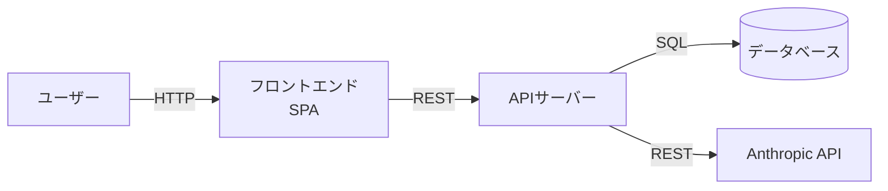
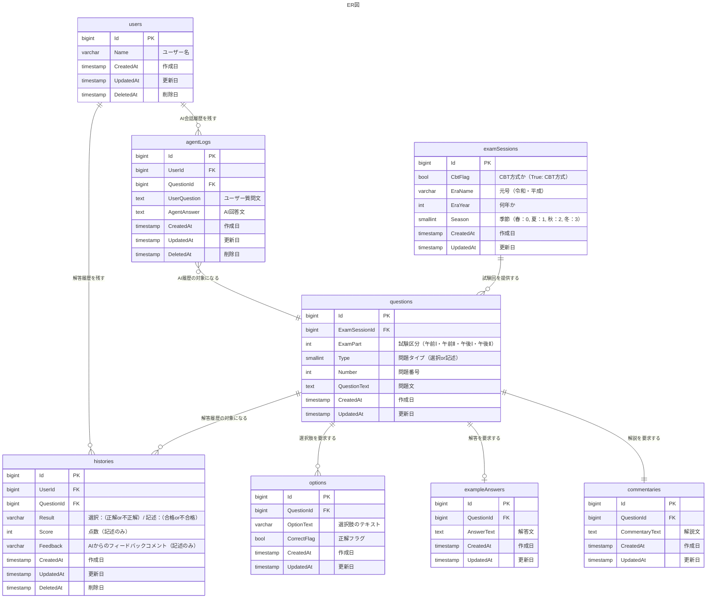

# データベーススペシャリスト過去問問答 基本設計書

| 項目 | 内容 |
| --- | --- |
| バージョン | 0.1 (draft) |
| 最終更新日 | 2026-05-31 |
| ステータス | 確定 |
| 関連ドキュメント | [要件定義書](./要件定義書.md) |

---

## 1. 概要

### 1.1 目的・対象範囲

全ての機能に共通する機能をまとめるための設計書です。（対象機能：全機能）

### 1.2 設計方針

- アプリ形態：SPA + API
- 言語・フレームワーク：React(js)/FastAPI(python)
- 過去問の持ち方：DB + 画像(図)

個人開発であるため、拡張性・保守性よりも開発スピードを重視する。（初期実装を優先し、後続フェーズでの再設計を許容する）

### 1.3 用語

| 用語 | 説明 |
| --- | --- |
| SPA | 単一の HTML を初回ロードし、以降は JS による画面切り替え（クライアントサイドルーティング）と API 通信 で動作する Webアプリ方式 |

---

## 2. システム構成

### 2.1 構成図

### 2.2 技術スタック

| レイヤ | 採用技術 | 採用理由 |
| --- | --- | --- |
| フロントエンド | React | 学習コストが低いため。 |
| バックエンド | FastAPI | AIライブラリのエコシステムが豊富であるため。 |
| データベース | PostgreSQL | 学習コストが低いため。 |
| インフラ | Docker/Docker Compose | 学習目的 |
| 認証 | 現時点では対象外 | 現時点では対象外 |
| 監視・ログ | 現時点では対象外 | 現時点では対象外 |

### 2.3 外部システム・サービス連携

| ID | 連携先 | 用途 | 通信方式 | 認証方式 |
| --- | --- | --- | --- | --- |
| EXT-1 | Anthropic API | バッチ処理(F-001~F-004)・AIチャット機能(F-012) | REST | APIキー |

---

## 3. データ設計

### 3.1 ER 図

### 3.2 テーブル一覧

| ID | テーブル名 | 概要 | 主な保持データ |
| --- | --- | --- | --- |
| T-1 | users | ユーザー情報を保持する。 | ユーザーID, ユーザー名 |
| T-2 | agentLogs | AIに対する質問とその回答の記録を保持する。 | ユーザー質問, AI回答 |
| T-3 | questions | 問題に関する情報を保持する。（マスターデータ）| 問題文, 試験区分, 問題番号 |
| T-4 | examSessions | 試験回に関する情報を保持する。（マスターデータ）| 年号, 年, 季節 |
| T-5 | histories | ユーザーの解答記録を保持する。 | 結果（正解・不正解 / 合格・不合格）, 点数 |
| T-6 | options | 選択式問題の選択肢に関する情報を保持する。（マスターデータ）| 選択肢文, 正解フラグ |
| T-7 | exampleAnswers | 記述式問題の解答例情報を保持する。（マスターデータ）| 解答例 |
| T-8 | commentaries | 解説文を保持する。（マスターデータ）| 解説文 |

### 3.3 データ保持・ライフサイクル方針

- 保持期間：最終更新日から1年経過（論理削除対象）
- 論理削除／物理削除：論理削除。ただし、マスタデータ系（DeletedAtカラムが存在しないもの）は原則削除しない。
- バックアップ：考慮しない

---

## 4. エラー・例外設計

### 4.1 エラーコード体系

| ID | コード | 区分 | 発生箇所 | 意味 | HTTP ステータス |
| --- | --- | --- | --- | --- | --- |
| E-1 | `EXT_REQUEST_TIMEOUT` | 外部連携 | バッチ処理・AIチャット | Anthropic API への要求がタイムアウトした | 504 |
| E-2 | `EXT_RATE_LIMITED` | 外部連携 | バッチ処理・AIチャット | Anthropic API のレート制限を超過した | 429 |
| E-3 | `EXT_API_ERROR` | 外部連携 | バッチ処理・AIチャット | Anthropic API がエラー応答を返した | 502 |
| E-4 | `VALIDATION_REQUIRED` | 入力 | API 全般 | 必須項目が未入力 | 400 |
| E-5 | `VALIDATION_INVALID` | 入力 | API 全般 | 入力値が不正（範囲外・形式違反など） | 400 |
| E-6 | `RESOURCE_NOT_FOUND` | リソース | 問題・履歴取得 | 指定された問題・試験回が存在しない | 404 |
| E-7 | `INTERNAL_ERROR` | システム | 全般 | 想定外のサーバーエラー | 500 |

### 4.2 共通エラーハンドリング方針

- ユーザー向け表示：「時間をおいて再度読み込んでください。」などのように、エラーに応じて具体的な次のアクションを促すメッセージをエラー画面に出す。
- ログ出力方針：エラーコードと発生時刻、リクエスト内容を出す。500系はERROR系はWARNとする。
- リトライ可否の方針：実装フェーズで決定。

---

## 5. 非機能設計（実装方針）

| カテゴリ | 要件（要件定義から） | 実現方針 |
| --- | --- | --- |
| パフォーマンス | バッチ処理時間（3h以内）・AI処理時間（30s以内） | 検討中 |
| セキュリティ | フレームワーク標準対策に準拠 | -（例：CSRF トークン、XSS 対策、入力バリデーション） |
| 可用性 | 要件なし | - |
| 運用・監視 | 要件なし | -（例：エラーは Sentry、メトリクスは CloudWatch） |
| ログ | 要件なし | -（例：構造化ログ、PII マスキング） |

---

## 6. テスト方針

現時点では対象外。

---

## 7. 課題・検討事項

| ID | 課題 | 影響 | 対応方針／期限 |
| --- | --- | --- | --- |
| Q-1 | デプロイ方針未確定（インフラ／監視・ログを含む） | 運用設計・デプロイ作業全般 | デプロイ検討フェーズで決定 |
| Q-2 | 認証要否の判断未確定（個人利用なら不要だが、公開する場合は必要） | 認証機構の実装要否、データモデル | 公開判断時に決定 |
| Q-3 | テスト方針未策定 | 品質保証範囲が不明 | 実装フェーズ前に決定 |
| Q-4 | パフォーマンス要件（バッチ3h以内・AI 30s以内）の実現方針 | 詳細設計（バッチ処理・AI連携） | 詳細設計フェーズで決定 |
| Q-5 | リトライ可否の方針 | 外部連携の安定性 | 実装フェーズで決定 |

---

## 改訂履歴

| バージョン | 日付 | 変更内容 |
| --- | --- | --- |
| 0.1 | 2026-05-31 | 初版ドラフト |
